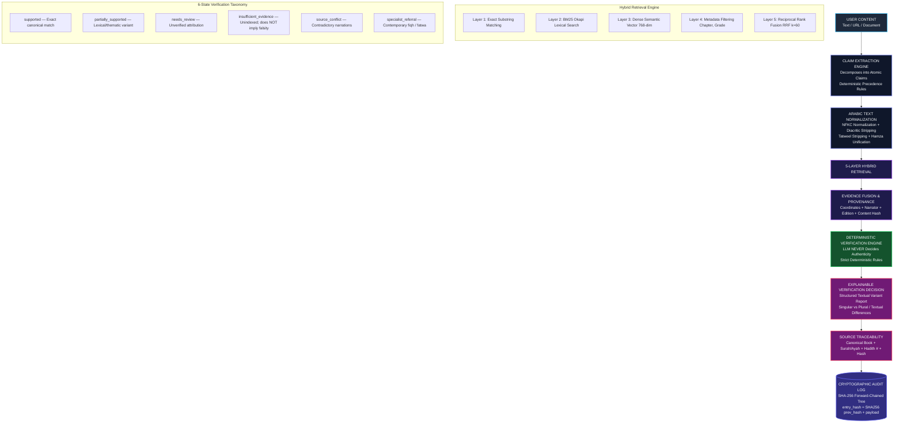

# MUSNAD AI — Architecture Diagram Specification

**Purpose:** Definitive visual and architectural blueprint for MUSNAD AI verification infrastructure.  
**Core Thesis:** $\text{LLM} \neq \text{Source of Truth}$. Verification is computed by deterministic rule logic over immutable, hashed evidence.

---

## 1. Complete Architecture Flowchart

---

## 2. Key Architectural Invariants

1. **The LLM is Never the Source of Truth:**
   - LLMs only assist with candidate claim extraction and vector embedding generation.
   - The status decision (`supported`, `insufficient_evidence`, `specialist_referral`, etc.) is computed exclusively by deterministic Python logic.
2. **Deterministic Precedence Order:**
   $$\text{Prompt Injection Defense} \to \text{Contemporary Fiqh} \to \text{Scholarly Attribution} \to \text{Quran} \to \text{Hadith} \to \text{Historical} \to \text{General}$$
3. **Safe Abstention Standard:**
   - Absence in database $\ne$ Theological falsity.
   - Unverified Hadiths evaluate to `insufficient_evidence`, never automated declarations of fabrication.
4. **Cryptographic Immutability:**
   - Every verified source is indexed with an immutable SHA-256 content hash.
   - Every verification result is appended to a forward-chained hash tree, preventing retrospective tampering.
