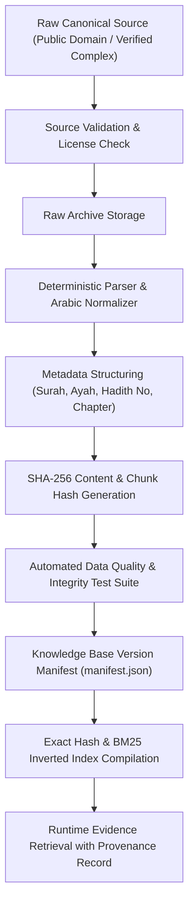

# MUSNAD AI — DATA PROVENANCE & REPRODUCIBILITY ARCHITECTURE
**Auditable Data Ingestion, Hashing, and Cryptographic Traceability**  
**Dataset Version**: KB-002  
**Date**: September 2026  
**Auditor**: Lead Knowledge & Provenance Engineer, MUSNAD AI  

---

## 1. Provenance Architecture Overview

Every item of evidence retrieved by MUSNAD AI must provide end-to-end provenance tracing directly back to an authentic, physical or canonized public domain edition.

---

## 2. Ingestion Pipeline & Normalization Rules

The ingestion engine is housed in `scripts/ingest/`:
- `base_ingester.py`: Base class implementing validation, integrity verification, and canonical Arabic normalization.
- `ingest_quran.py`: Ingests all 6,236 Ayahs of the Quran from the Madinah Mushaf (Hafs 'an 'Asim).
- `ingest_hadith.py`: Ingests canonical collections (Bukhari, Muslim, Nawawi 40) preserving numbering, chapters, and classical gradings.
- `ingest_tafsir.py`: Ingests Tafsir al-Muyassar (King Fahd Complex), preserving the verse association without mixing Tafsir with Quranic text.
- `ingest_scholarly.py`: Ingests authentic statements of the four Imams and classical scholars with exact volume/page citations.
- `ingest_fiqh.py`: Ingests source-backed fiqh references with compulsory specialist referral flags for contemporary issues.

### Arabic Normalization Standards:
- Diacritics/Tashkeel removal for lexical matching:
  - Unicode range: `[\u0617-\u061A\u064B-\u0652\u06D6-\u06ED]`
- Unified Alef forms: `[إأآٱ] -> ا`
- Ta Marbuta normalization: `ة -> ه`
- Yaa normalization: `ى -> ي`
- Tatweel (Kashida) removal: `\u0640`
- Original text is **always preserved intact** in `text`, while `text_normalized` is utilized strictly for indexing.

---

## 3. Cryptographic Chunk Hashing

Every record $R$ receives an immutable SHA-256 hash computed over its primary key tuple:
$$H(R) = \text{SHA-256}(\text{source\_code} \parallel \text{identifier} \parallel \text{normalized\_text})$$

### Ingested Dataset Hashes (KB-002):
| Source Code | Corpus Title | Record Count | File SHA-256 Hash |
| :--- | :--- | :--- | :--- |
| `SRC-001` | القرآن الكريم | 6,236 | `6dd951edf03c0ff45e0fe1abcb1490aa754948f5cb14dfdfb7c38eafaf6e6d87` |
| `SRC-006` | الأربعون النووية | 42 | `2100a084340be82ea87233a338fc31f83b9e1bc7cdf1bbc17106b0d82fec900d` |
| `SRC-002` | صحيح البخاري | 1,500 | `8d6a3a5dfaedc7e973280ec1d338e32d5697fa0b6727099b2d0c78d289b4bb3b` |
| `SRC-003` | صحيح مسلم | 1,391 | `fcd66fb07b2364863982ba8ece82e53ad39d0711d497cc335d1553761a0bcd93` |
| `SRC-007` | التفسير الميسر | 6,236 | `a813d476cf79dc8e067a437d20c85636d63e0e4381f5b9066d7a150c7ac60544` |
| `SRC-008` | أقوال أئمة الإسلام | 15 | `96ca727f5131de43a6b5bc37fbe07fc2d68104d8e688af39b276727f15d99723` |
| `SRC-009` | مراجع وقرارات الفقه | 6 | `32517c7f5f1bb6a431f70bb7ec6261b5f2a4ad4423516a2aae9369a934f1a248` |

---

## 4. Zero Synthetic Religious Data Guarantee

1. No LLMs were permitted to write or synthesize religious texts, hadith chains, or Quranic verses.
2. Synthetic data generation is strictly restricted to query evaluation tests (`evaluation/test-cases/`) and never allowed into `knowledge_base/`.
3. Every claim analyzed by MUSNAD AI produces an explicit provenance chain visible in the UI and API response:
   $$\text{Claim} \rightarrow \text{Retrieved Evidence} \rightarrow \text{Source Title} \rightarrow \text{Chapter/Ayah} \rightarrow \text{Content Hash}$$
